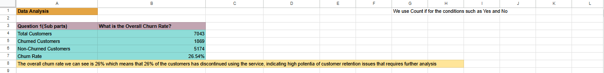
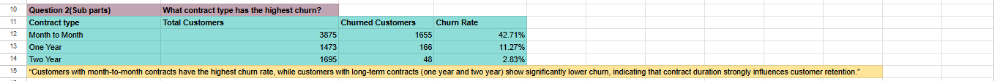
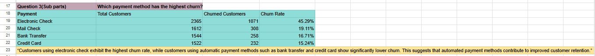
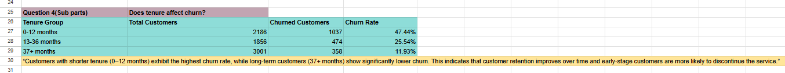
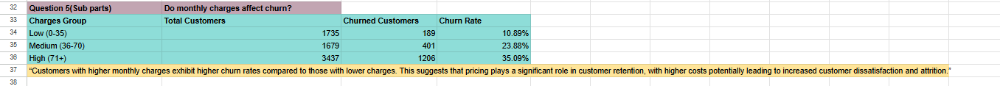
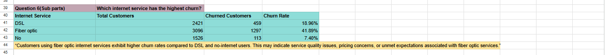

# Customer Churn Analysis

## Project Overview
This project analyzes customer churn behavior to identify key factors influencing customer retention. The analysis was conducted using data cleaning techniques, spreadsheet calculations, and visualization through Power BI.

---

## Objectives
- Measure overall churn rate
- Identify high-risk customer segments
- Analyze impact of contract type, payment method, and tenure
- Generate business insights for retention strategies

---

## Tools Used
- Excel / Google Sheets
- Power BI
- GitHub

---

## Data Cleaning
- Removed duplicates
- Handled missing values
- Organized dataset for analysis
- Created calculated metrics

---

## Key Insights
- Overall churn rate is approximately **26%**
- Month-to-month contracts have the highest churn
- Electronic check users show higher churn behavior
- Customers with low tenure are more likely to churn
- Long-term customers show strong retention

---

## Analysis Preview

### 🔹 Churn Overview

### 🔹 Contract Analysis

### 🔹 Payment Method Analysis

### 🔹 Tenure Analysis

### 🔹 Charges Analysis

### 🔹 Internet Service Analysis

---

## Files Included
- Excel dataset and analysis file
- Visual screenshots of analysis
- Business insights and findings

---

## Business Recommendation
Focus on improving early customer engagement, promoting long-term contracts, and enhancing trust in payment systems to reduce churn.

---

## 👤 Author
Muhammad Rahil Pervaiz
